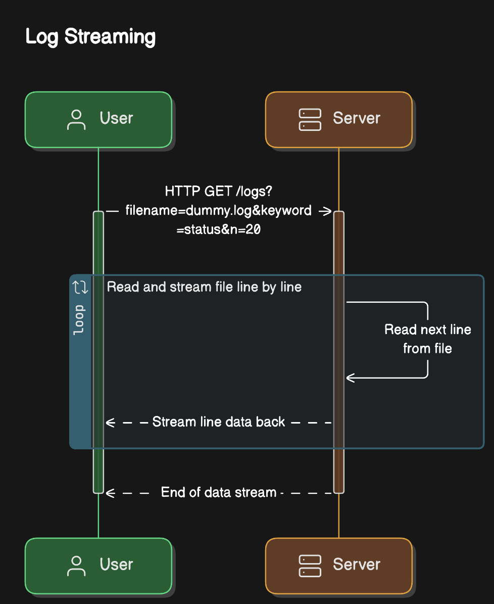
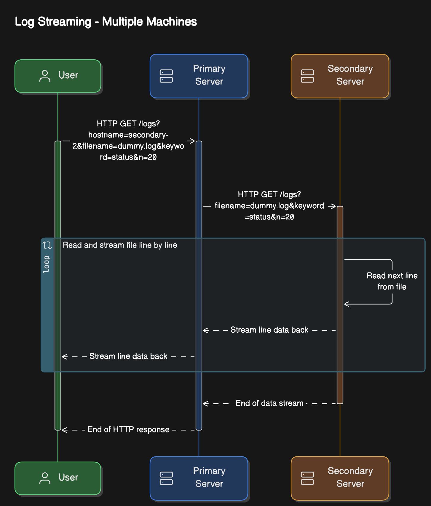

# Log Agent

## Development 

### Setup

- Install [Poetry](https://python-poetry.org/docs/#installation)
- Install [poethepoet](https://github.com/nat-n/poethepoet)
- [Optional] Configure Poetry to create `.venv` folder in the project root: `poetry config virtualenvs.in-project true`
- Install project dependencies: `poetry install` / `poe install`

### Usage

- FastAPI Development Mode: `poe dev`
- FastAPI Production Mode: `poe prod`
- Tests: `poe test`
- Lint using Ruff: `poe lint`

## Demo

- Install [Docker (and Docker Compose)](https://docs.docker.com/get-docker/)
- Build the Docker Image: `poe build`
- Spin up Docker containers: `poe up`
- Send HTTP request to the server: 
    ```(bash)
    curl -X 'GET' \
        'http://0.0.0.0:8000/logs?hostname=secondary-2&filename=alternatives.log&keyword=updated&n=20' \
        -H 'accept: text/plain'
    ```
- View Logs: `poe logs` or `poe logs secondary-2`
- Stop demo: `poe down`

## Overview



### [Log Library](app/logs.py)
- Provides utility functions for finding (`find_log`) and searching log files (`search_log`). The user of the library should call `find_log` first before calling `search_log`
- `search_log` applies search rules on the output of the log reading
- The log reading (`read_log`) is implemented by seeking (`f.seek`) file in chunks (using a `chunk_size`) so that reading begins from the last chunk. Each chunk is expected to output 1 or more lines (delimited by `\n`)
- The reader is implemented as a generator that yields lines

### [Streaming](app/server.py)
- HTTP is used as the primary protocol for streaming logs. FastAPI framework is used to implement the HTTP Streaming Response. FastAPI internally uses Starlette implementation of the ASGI spec
- The HTTP handler for the `/logs` Streaming endpoint accepts a `filename`, `keyword` and `n` as parameters. The handler uses the Log Library to generate the streaming response

## [Bonus: Multiple Machines Demo](docker-compose.yml)



- To simulate log retrieval from multiple machines, this repo provides a demo orchestrated by Docker Compose. It sets up a primary server and multiple secondaries in Docker containers:
    - Primary Server
        - `/logs` endpoint also accepts a `hostname` parameter that is used to send the request to the corresponding secondary server
        - The primary server knows about the secondaries as Docker Compose creates an environment variable for the same. It is able to make network calls to the secondary server using Docker Compose's Bridge network
        - [httpx](https://www.python-httpx.org/) is used to send the request to the secondary server as it provides graceful handling of streamed responses
    - 3x Secondary Servers
        - work as described in the [Protocol for Streaming](###Streaming) section

## Potential Weaknesses/Improvements

### Testing
- No unit tests for handlers
- No end to end tests

### Functional
- There's no endpoint that implements `ls` so the client must already know the name of the log file that it needs
- Config for the secondary servers is hardcoded in the `docker-compose.yml` file for the demo. In real world, this would be more dynamic using Service Discovery (like Istio). This would allow the secondaries to be automatically discovered by the primary server
- Keyword search is only implemented within a line and not across lines so it's not possible to search for a keyword that may exist across multiple lines
- No authentication/authorization

### Reliability
- File reading is a blocking operation
    - Using a Thread Pool Executor to read the file in a separate thread is one way to manage this blocking operation in an async task (i.e., FastAPI handler)
    - However, this means that careful selection of the number of max workers is required which is usually the max number of CPU cores
    - If the rate of requests is large and the workers are unavailable, the server will start queueing requests which will increase API latency or cause HTTP timeout (if configured), eventually causing the server to crash due to increase in memory usage
    - If the workers scale well with the expected requests load, the other bottleneck could be the Disk I/O
- If error happens during streaming, the server can recover but cannot propagate the error to the client using standard HTTP error codes. It can only send it as part of the streaming response
    - This is because HTTP Response codes are sent as Response Headers BEFORE streaming begins. This is expected as per the HTTP spec
    - The server can send the error code as a Response Trailer as per the HTTP spec. However, most Python HTTP frameworks (FastAPI/Starlette in our case) implement ASGI spec and the ASGI spec [does not support HTTP Trailers](https://github.com/encode/starlette/discussions/1739#discussioncomment-3094935)

### Observability
- Not logging server logs into log files
- No observability per request/response i.e., no tracing across primary and secondaries to filter the logs